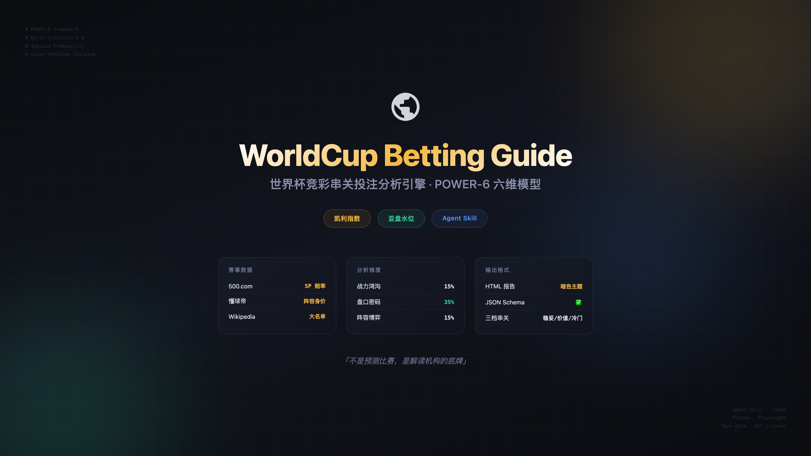
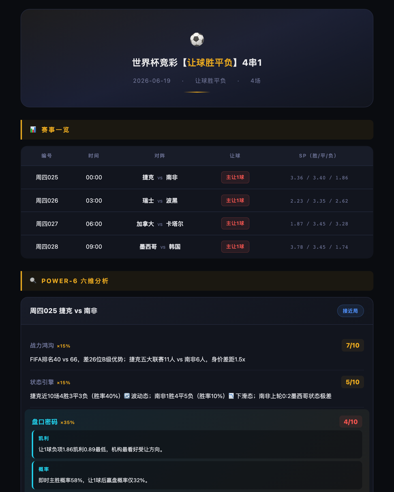
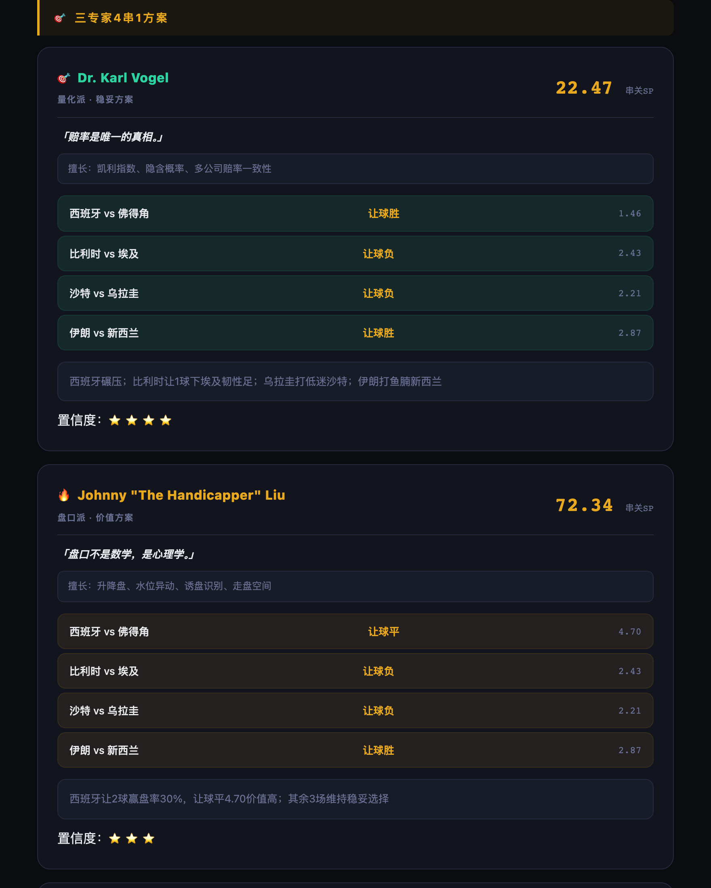

<p align="center">
  
</p>

<p align="center">
  <strong>「不是预测比赛，是解读机构的底牌」</strong>
</p>

<p align="center">
  <a href="#license"></a>
  <a href="https://htmlpreview.github.io/?https://raw.githubusercontent.com/Terrylol/worldcup-betting-guide/main/docs/2026-06-19-rangqiu-report.html"></a>
  <a href="https://github.com/Terrylol/worldcup-betting-guide"></a>
  
</p>

---

## 👀 先看输出再说别的

这不是个命令行工具，这是一个 **Agent Skill**。把它加载进 Codex / Claude Code，说一句话就出报告：

> "分析6月19日世界杯让球胜平负4串1，出 HTML 报告"

<p align="center">
  
</p>

**[👉 点击查看完整样例报告](https://htmlpreview.github.io/?https://raw.githubusercontent.com/Terrylol/worldcup-betting-guide/main/docs/2026-06-19-rangqiu-report.html)**

---

## 🚀 30 秒上手

### 方式一：用 npx skills 安装（推荐）
```bash
# 全局安装（所有 agent 可用：Codex / Claude Code / Cursor / ...）
npx skills add Terrylol/worldcup-betting-guide -g

# 只安装到某个平台
npx skills add Terrylol/worldcup-betting-guide -g --agent claude-code
npx skills add Terrylol/worldcup-betting-guide -g --agent codex

# 当前项目专用
npx skills add Terrylol/worldcup-betting-guide
```

### 方式二：手动安装

克隆到你所用 Agent 的 skills 目录即可，通常在 `~/.codex/skills/` 或 `~/.claude/skills/`。

安装后重启 Agent，直接问：
> "分析明天世界杯让球胜平负3串1，出 HTML 报告"

**兼容 50+ 个 Agent 平台**：Codex · Claude Code · OpenClaw · Cursor · Trae · Trae CN · Zed · Windsurf · Continue · ...

---

## 🧠 它怎么工作的？

<p align="center">
  
</p>

### POWER-6 六维分析模型 + 三专家决策层

本项目分两层：**POWER-6** 负责逐场比赛的证据拆解与评分，**三专家体系** 负责把这些证据转化为不同风险偏好的串关方案。两者不冲突：前者回答“这场比赛有哪些信号”，后者回答“不同风格的人会怎么串”。

每场比赛从 6 个维度加权评分，盘口相关维度占 35% 绝对权重：

| 维度 | 权重 | 说明 |
|------|------|------|
| ⚔️ 战力鸿沟 | 15% | FIFA排名 + 身价差 + 五大联赛人数 |
| 🔋 状态引擎 | 15% | 近10场走势 + 胜率/赢盘率背离检测 |
| **🔐 盘口密码** | **35%** | 凯利指数 × 4 + 隐含概率趋势 + 亚盘水位异动 + 返还率差异 |
| 🤝 交锋心结 | 10% | 血脉压制 / 苦主效应 / 杯赛基因 |
| ♟️ 阵容博弈 | 15% | 核心球员健康 + 战术克制 + 伤停 |
| 🌑 赛程暗线 | 10% | 体能储备 + 轮换空间 + 开赛时间 |

### 为什么是 "交叉验证"？

市面上的分析都是"我觉得谁赢" — 我们不一样：
- **凯利指数**：机构风控底牌，低于返还率 = 控制赔付方向
- **隐含概率**：看初盘→即时的变化趋势，不是绝对值
- **亚盘水位**：升盘不升水 = 真看好，降盘不降水 = 诱上
- **返还率差异**：竞彩 88% vs 主流公司 95%，7% 的差额不是白给的

四个维度指向一致才给高分，方向矛盾就标冷门预警。

### 三专家体系是什么？

| 专家 | 风格 | 关注点 | 常见输出 |
|------|------|--------|----------|
| 🎓 量化派 | 保守 | 凯利指数、隐含概率、多公司赔率一致性 | 稳妥方案 |
| 👴 盘口派 | 价值 | 亚盘升降、水位异动、诱盘/阻上 | 价值方案 |
| 🕵️ 消息派 | 冷门 | 伤停、轮换、战意、赛程暗线 | 冷门方案 |

最终报告会同时保留 POWER-6 的中立证据链，以及三专家的不同组合逻辑。

---

## 📊 输出什么？

<p align="center">
  
</p>

**三专家串关方案：**

| 方案 | 专家 | 决策风格 |
|------|------|----------|
| 🎯 稳妥 | Dr. Karl Vogel · 量化派 | 凯利 / 概率 / 赔率一致性 |
| 🔥 价值 | Johnny Liu · 盘口派 | 亚盘 / 水位 / 诱盘 / 走盘空间 |
| 💎 冷门 | Mia Carter · 消息派 | 伤停 / 轮换 / 战意 / 临场变量 |

---

## 📁 项目结构

```
worldcup-betting-guide/
├── SKILL.md                          # Skill 入口定义（给 Agent 读的）
├── README.md                         # 你正在看的
├── assets/                           # 可视化素材
├── agents/
│   └── openai.yaml                   # Codex 插件注册
├── scripts/
│   ├── fetch_matches.py              # 500.com 赛事 + SP 赔率
│   ├── fetch_analysis.py             # 数据页 / 亚盘 / 欧赔 → 纯文本
│   ├── fetch_squad.py                # 懂球帝阵容 / 身价 API
│   ├── fetch_squad_wiki.py           # Wikipedia 大名单
│   └── generate_report.py            # JSON Schema → HTML 报告
├── references/
│   ├── analysis_methodology.md       # POWER-6 方法论文档
│   ├── data_sources.md               # 数据源技术手册
│   ├── report_schema.md              # 报告 JSON Schema 与生成流程
│   ├── report_templates.md           # 文本/HTML 输出格式规范
│   ├── squad_search.md               # 阵容数据获取指南
│   └── report_template.html          # HTML 报告模板
└── docs/
    ├── 2026-06-19-rangqiu-report.html              # 让球胜平负4串1样例
    ├── 2026-06-19-rangqiu-2x1-report.html          # 让球胜平负2串1样例
    └── 2026-06-19-shengpingfu-2x1-report.html      # 胜平负2串1样例
```

---

## ⚠️ 免责声明

本项目仅供娱乐和学习参考，**不构成任何投注建议**。

- 足球比赛结果受无数因素影响，任何模型都无法保证准确性
- 凯利指数、隐含概率等指标反映的是机构态度，不代表赛果
- 串关投注风险极高，请理性对待
- 量力而行，切勿沉迷

**如果你因为看了这个项目而输了钱，那只能说明你比我还信这个模型。**

---

## 📜 License

MIT

---

<p align="center">
  <sub>Made with ❤️ for football nerds and stats lovers</sub>
</p>
